# SignalDeck Project Foundation

## Objective

Build the initial foundation for SignalDeck, a personal intelligence dashboard designed to monitor cybersecurity threats, global events, financial markets, cryptocurrency, and prediction markets.

## Work Completed

- Created the public SignalDeck GitHub repository
- Configured the repository with a README, Python `.gitignore`, and MIT license
- Cloned the repository locally using Visual Studio Code
- Created the initial project structure:
  - `backend`
  - `frontend`
  - `docs`
  - `screenshots`
- Installed and configured Python
- Created a Python virtual environment
- Installed FastAPI and Uvicorn
- Created the first SignalDeck API endpoint
- Verified the API using the browser and FastAPI Swagger UI
- Created `requirements.txt` for Python dependency tracking
- Committed and pushed the initial project foundation to GitHub

## Technologies Used

- Python
- FastAPI
- Uvicorn
- Git
- GitHub
- Visual Studio Code
- PowerShell

## API Test

The initial API endpoint returned:

```json
{
  "message": "SignalDeck API is online"
}

## CISA Known Exploited Vulnerabilities Integration

Integrated the CISA Known Exploited Vulnerabilities (KEV) Catalog into the SignalDeck backend.

### Features Implemented

- Created a `/cyber/kev` FastAPI endpoint
- Used HTTPX to retrieve live vulnerability data from CISA
- Added a configurable `limit` query parameter
- Limited accepted values between 1 and 100
- Parsed the CISA response to return relevant vulnerability intelligence
- Included CVE ID, vendor, product, vulnerability name, dates, known ransomware use, and CWE information
- Added HTTP error handling for failed external API requests
- Verified the endpoint through FastAPI Swagger UI
- Successfully received a `200 OK` response with live CISA KEV data

### Screenshot

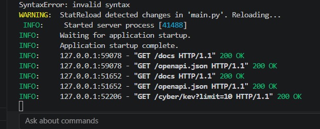

## NVD CVE Integration

Integrated the NIST National Vulnerability Database (NVD) API to allow SignalDeck to retrieve detailed information for a specific CVE.

### Work Completed

- Added the NVD CVE API as a second cybersecurity intelligence source
- Created the `/cyber/cve/{cve_id}` API endpoint
- Added support for looking up individual vulnerabilities by CVE ID
- Tested the endpoint using `CVE-2021-44228` (Log4Shell)
- Verified the endpoint through FastAPI Swagger UI
- Successfully received a `200 OK` response from the CVE lookup

### Screenshot

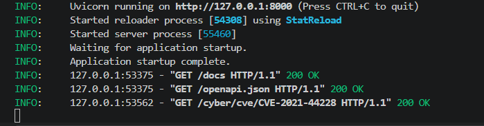

## NVD CVE Data Enrichment

Enhanced the SignalDeck NVD CVE lookup endpoint to provide additional vulnerability intelligence for use in the future Cyber dashboard.

### Features Implemented

- Added CVE publication date
- Added last modified date
- Added associated CWE weakness information
- Added up to five external reference URLs
- Maintained CVSS score, severity, vector, and vulnerability description
- Tested the enriched endpoint using `CVE-2021-44228` (Log4Shell)
- Verified the enriched API response returned `200 OK`

### Enriched CVE Data

The `/cyber/cve/{cve_id}` endpoint now returns:

- CVE ID
- CVSS score
- Severity
- CVSS vector
- Description
- Published date
- Last modified date
- CWE weaknesses
- External references

### Screenshot

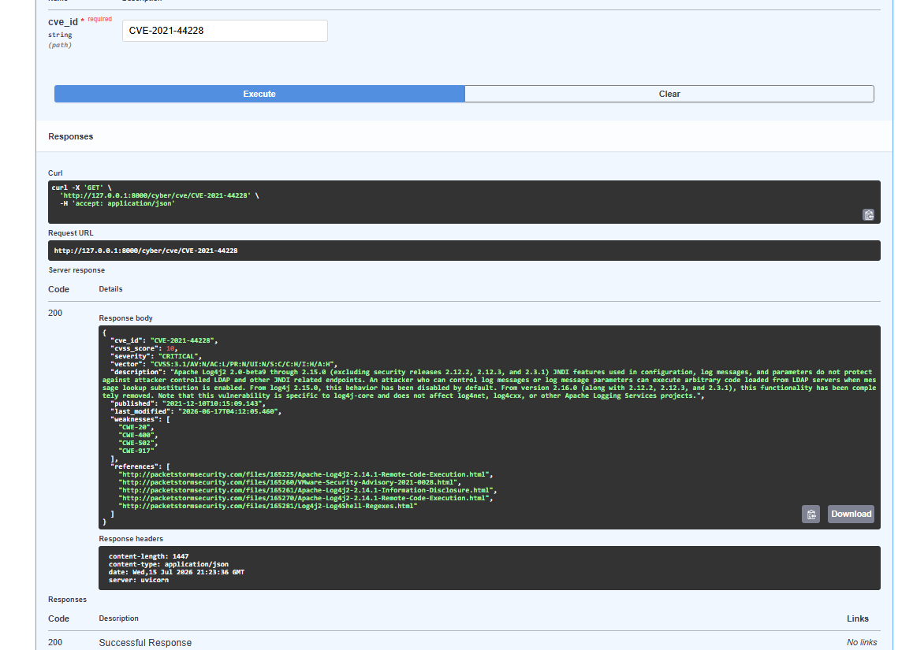

## Combined CISA KEV and NVD Intelligence

Created a combined cyber intelligence endpoint that enriches actively exploited vulnerability data from the CISA Known Exploited Vulnerabilities (KEV) Catalog with vulnerability severity data from the NIST National Vulnerability Database (NVD).

### Features Implemented

- Added the `/cyber/kev/enriched` endpoint
- Retrieves actively exploited vulnerabilities from CISA KEV
- Uses CVE IDs to retrieve additional vulnerability intelligence from NVD
- Combines data from both sources into a single API response
- Returns vendor, product, vulnerability name, and remediation dates
- Includes known ransomware campaign usage when available
- Adds CVSS score and severity from NVD
- Adds vulnerability descriptions from NVD
- Preserves CISA data if an individual NVD enrichment request fails
- Limited requests to a maximum of 10 vulnerabilities to reduce external API load
- Successfully tested the combined endpoint with a `200 OK` response

### Combined Intelligence Data

The `/cyber/kev/enriched` endpoint returns:

- CVE ID
- Vendor
- Product
- Vulnerability name
- Date added to CISA KEV
- Remediation due date
- Known ransomware campaign use
- CVSS score
- Severity
- Vulnerability description

### Screenshot

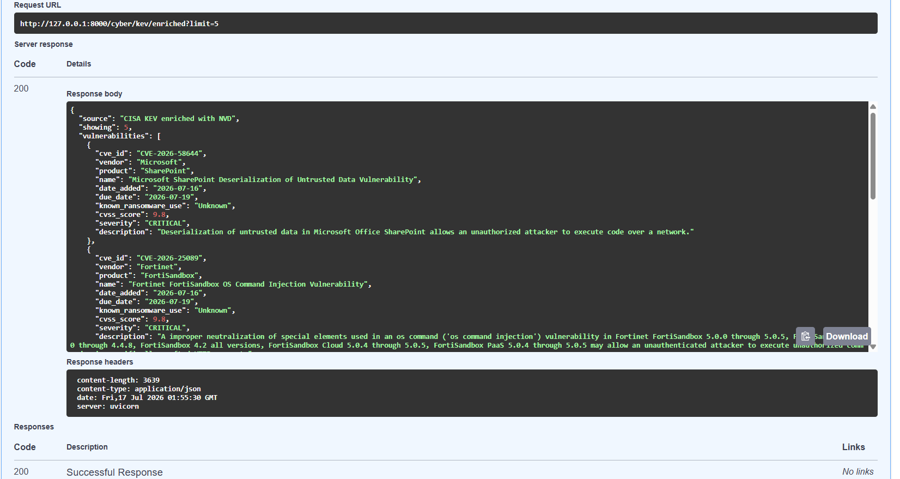

## Frontend Dashboard

### Work Completed

- Installed Node.js and npm for frontend development
- Created the SignalDeck frontend using Next.js
- Configured TypeScript, ESLint, Tailwind CSS, and the Next.js App Router
- Created the initial Cyber Intelligence Dashboard interface
- Connected the Next.js frontend to the FastAPI backend
- Integrated the `/cyber/kev/enriched` endpoint into the dashboard
- Successfully displayed live CISA Known Exploited Vulnerabilities as dashboard cards
- Displayed CVE IDs, vulnerability names, vendors, products, dates, and ransomware-use information
- Confirmed communication between the Next.js frontend and FastAPI backend
- Identified NVD enrichment fields that require additional frontend/backend troubleshooting

### Architecture Progress

The current SignalDeck data flow is:

`CISA KEV + NVD → FastAPI Backend → Enriched API Endpoint → Next.js Frontend Dashboard`

This establishes the initial full-stack architecture for SignalDeck and provides a foundation for additional cybersecurity intelligence sources, dashboard features, and future mobile application development.

### Screenshot

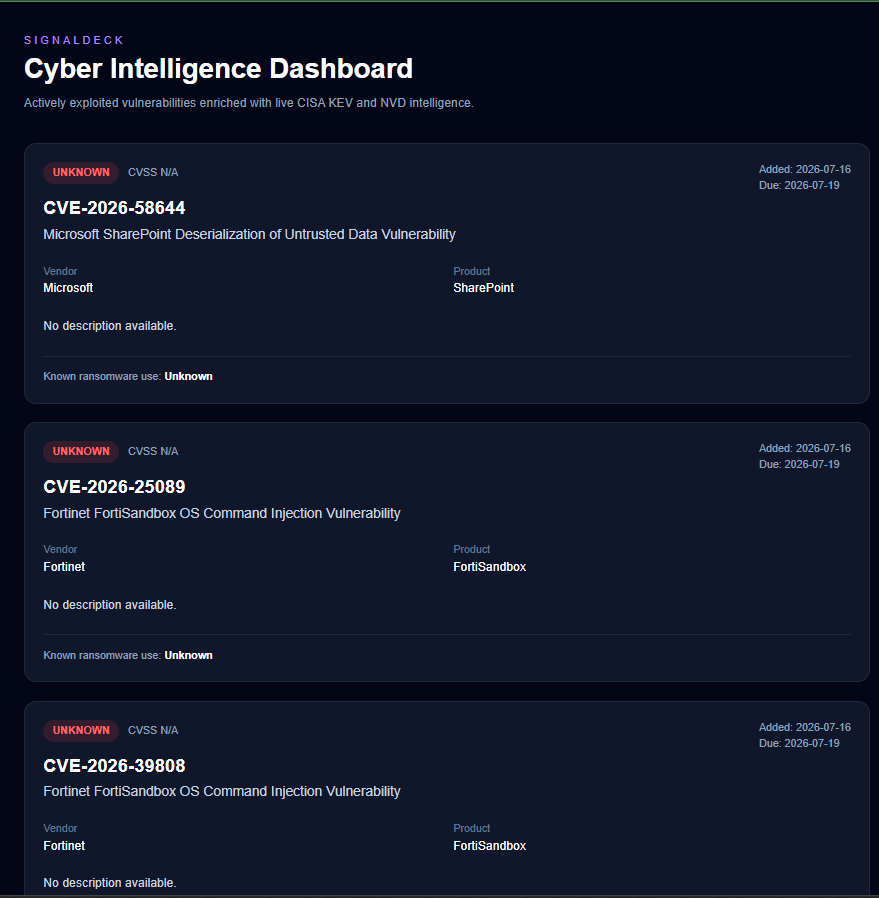

## Dashboard Summary Cards

### Work Completed

- Added a summary section to the SignalDeck Cyber Intelligence Dashboard
- Added a Critical Vulnerabilities metric
- Added an Average CVSS metric
- Added a Known Ransomware metric
- Added a Latest Added vulnerability date metric
- Calculated dashboard metrics dynamically from vulnerability data returned by the FastAPI backend
- Added responsive summary cards using Tailwind CSS

### Current Metrics

The summary cards currently calculate metrics from the vulnerabilities returned by the `/cyber/kev/enriched` endpoint. Future development will expand these metrics to represent a broader vulnerability dataset.

### Screenshot

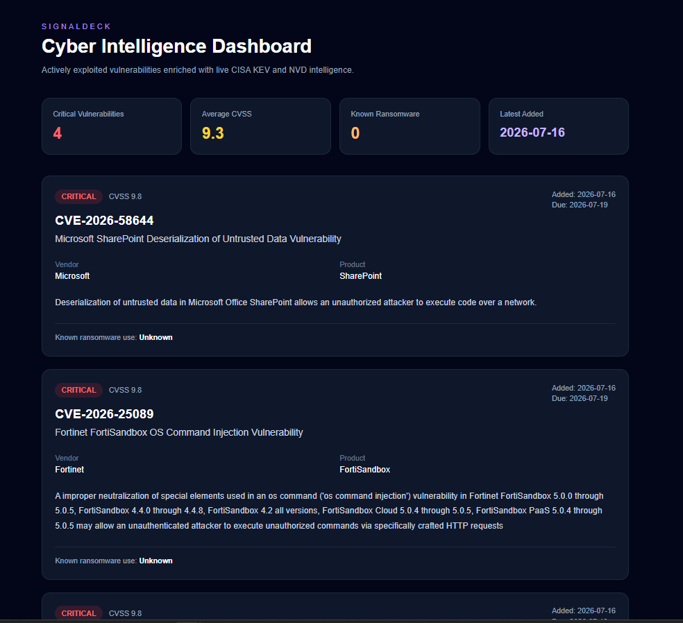

## Global Cyber Threat Level

### Work Completed

- Added a Global Cyber Threat Level banner to the SignalDeck dashboard
- Created dynamic threat-level logic based on vulnerability severity and CVSS scores
- Added Critical, Elevated, Moderate, and Low threat classifications
- Added contextual threat messaging based on the calculated threat level
- Displayed the number of critical vulnerabilities in the current feed
- Added a visual threat-level indicator above the dashboard summary metrics

### Current Threat Logic

The current threat level is calculated from vulnerabilities returned by the `/cyber/kev/enriched` endpoint:

- Critical: At least one Critical vulnerability with a CVSS score of 9.0 or higher
- Elevated: At least one High severity vulnerability
- Moderate: Active vulnerabilities are present without a High or Critical classification
- Low: No vulnerabilities are returned

Future development will expand the threat calculation to incorporate additional intelligence sources and broader threat indicators.

### Screenshot

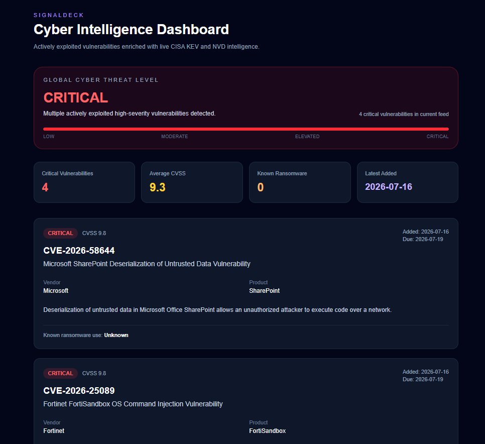

## Vulnerability Search and Filtering

### Work Completed

- Added interactive vulnerability search functionality
- Added severity-based filtering for Critical, High, Medium, and Low vulnerabilities
- Added real-time result counts showing filtered vulnerabilities
- Added support for searching by CVE ID, vendor, product, and vulnerability name
- Added a no-results message for searches or filters with no matches
- Separated the interactive vulnerability list into a reusable Next.js Client Component
- Preserved server-side vulnerability data fetching while enabling client-side interaction

### Search and Filter Behavior

The vulnerability search updates results dynamically as the user types. Users can search across CVE IDs, vendors, products, and vulnerability names.

The severity filter allows users to narrow the current vulnerability feed by severity classification. Search and severity filtering can also be used together.

### Screenshots

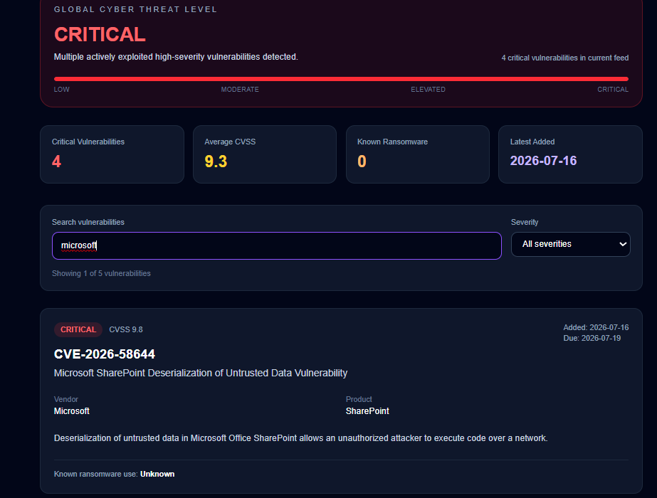

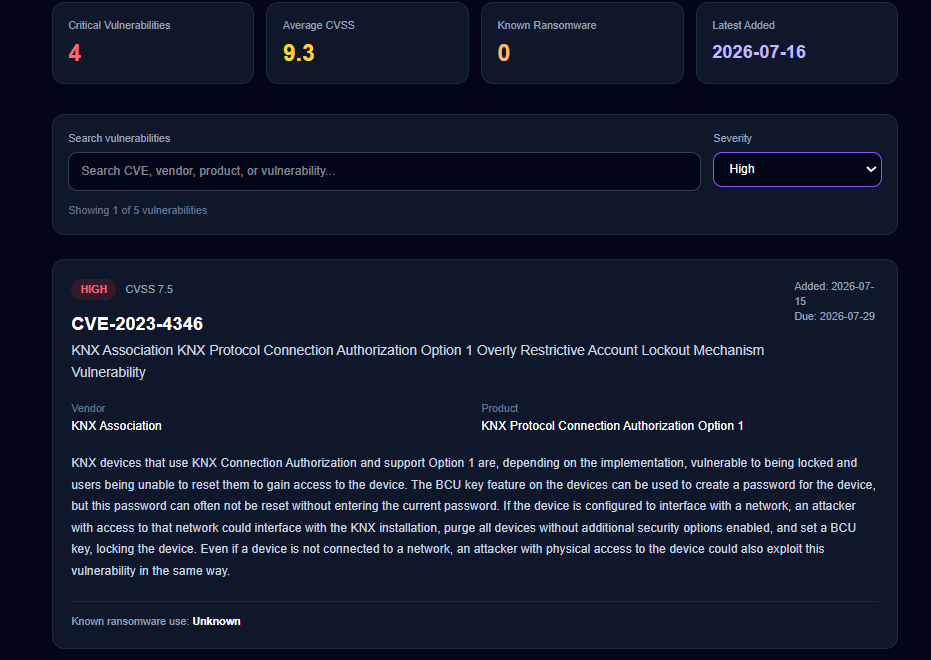

## CVE Details View

### Work Completed

- Added dedicated CVE detail pages using dynamic Next.js routes
- Made CVE IDs clickable from the vulnerability dashboard
- Connected individual CVE pages to the FastAPI `/cyber/cve/{cve_id}` endpoint
- Added detailed NVD vulnerability intelligence
- Displayed CVSS score and CVSS vector information
- Added published and last modified timestamps
- Added CWE weakness information
- Added external vulnerability references
- Added navigation back to the main Cyber Intelligence Dashboard

### CVE Drill-Down Workflow

Users can search or filter vulnerabilities from the main dashboard and select a CVE ID to open its dedicated intelligence page.

The details view retrieves enriched NVD data from the SignalDeck backend and provides additional technical information for vulnerability investigation.

### Screenshot

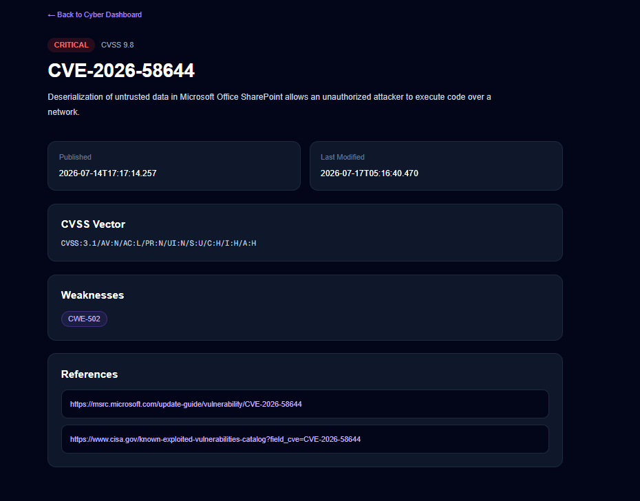

## Recent Threat Activity

### Work Completed

- Added a Recent Threat Activity section to the Cyber Intelligence Dashboard
- Displays the three most recently added vulnerabilities from the current intelligence feed
- Shows CVE ID, severity, CVSS score, vendor, product, and date added
- Dynamically sorts vulnerability data by the CISA KEV date added
- Integrated the activity feed between the dashboard summary metrics and vulnerability search tools

### Purpose

The Recent Threat Activity feed provides analysts with a quick view of newly added vulnerabilities without requiring them to review the full vulnerability list.

### Screenshot

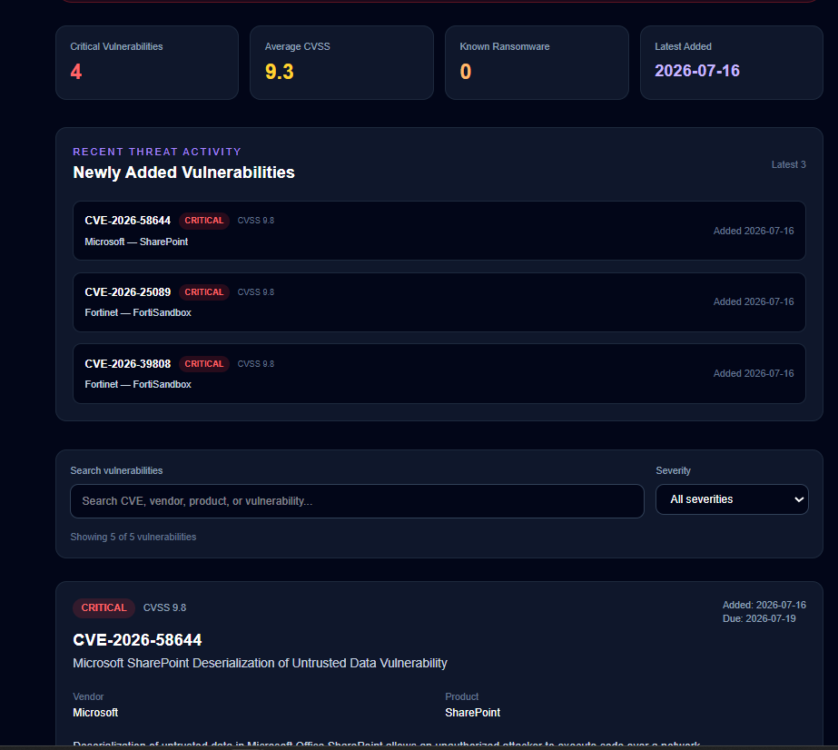

## Intelligence Refresh Control

### Work Completed

- Added a Last Updated indicator to the Cyber Intelligence Dashboard
- Added a Refresh Intelligence button for manually refreshing dashboard data
- Displays the time of the latest dashboard refresh
- Integrated the refresh control above the Global Cyber Threat Level section

### Purpose

The refresh control gives users visibility into when the dashboard intelligence was last loaded and provides a simple way to manually retrieve the latest available vulnerability data.

### Screenshot

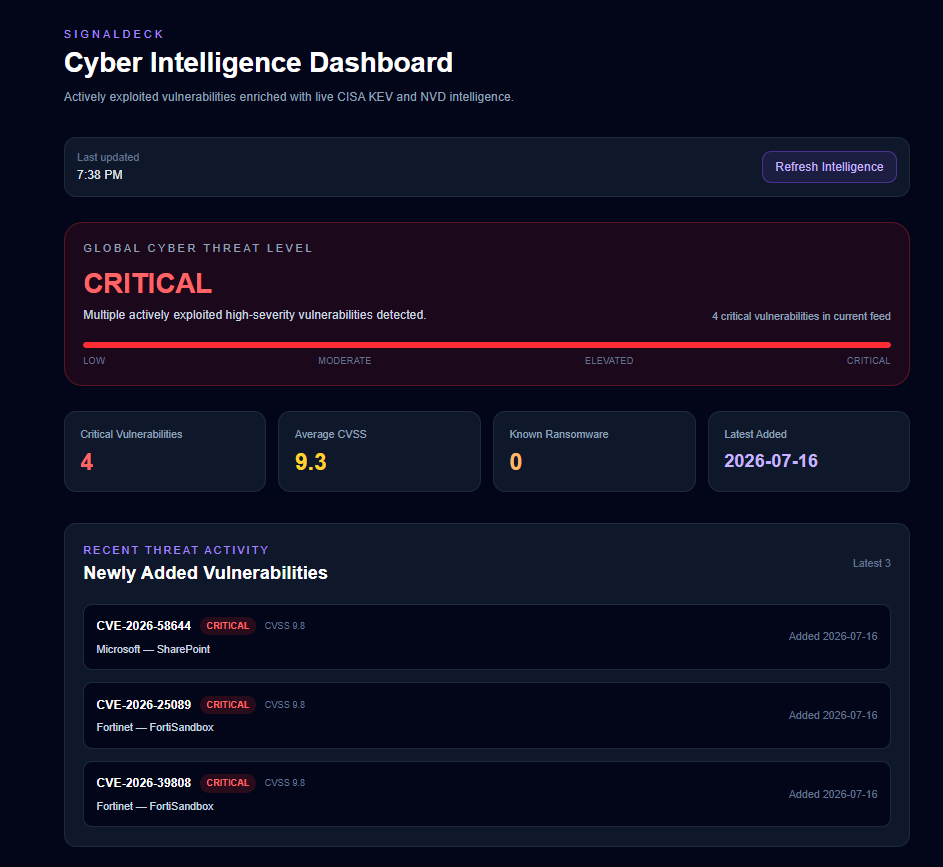
## Threat Intelligence Overview

### Work Completed

- Added a Threat Intelligence Overview section to the Cyber Intelligence Dashboard
- Added a Top Affected Vendors view based on the current vulnerability feed
- Dynamically groups vulnerabilities by vendor
- Ranks vendors by the number of vulnerabilities represented in the feed
- Displays up to five of the most affected vendors
- Integrated the overview between Recent Threat Activity and vulnerability search tools

### Purpose

The Threat Intelligence Overview helps analysts quickly identify which vendors are most represented in the current vulnerability feed, providing additional context about technologies affected by actively exploited vulnerabilities.

### Screenshot

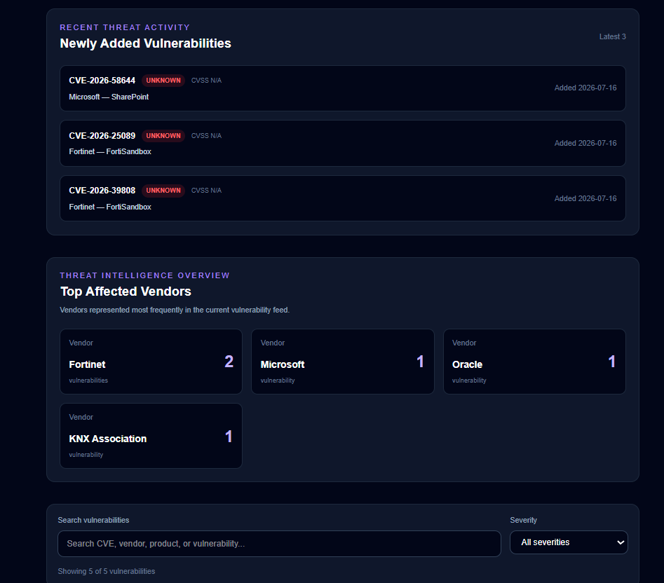